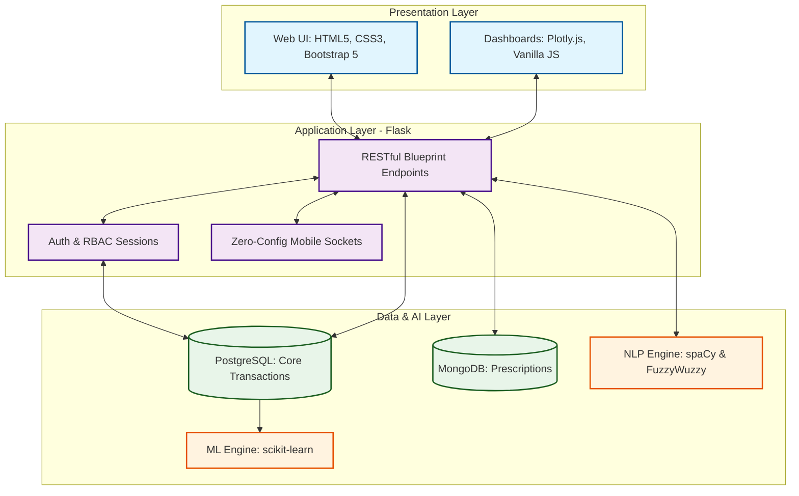
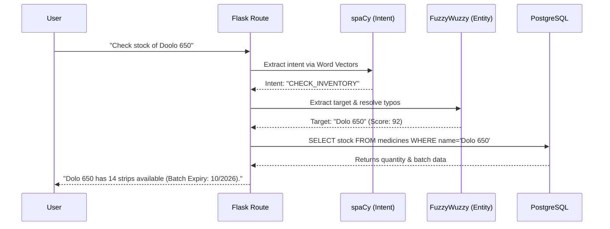

<div align="center">
  <h1>💊 PharmaTrust</h1>
  <p><b>An AI-Driven, Hybrid-Architecture Pharmacy Management System</b></p>
  
  
  
  
  
  
  
</div>

---

## 📖 Project Overview
PharmaTrust is a modern, full-stack pharmacy management platform designed to transcend traditional point-of-sale systems. By integrating **Machine Learning (ML)** for demand forecasting and **Natural Language Processing (NLP)** for intuitive data querying, it empowers pharmacists to make proactive, data-driven decisions. The system employs a robust **Hybrid Database Architecture**, ensuring ACID-compliant financial transactions alongside flexible clinical document storage.

---

## ✨ Core Innovations & Features

* 📈 **Predictive Demand Forecasting**: Analyzes 30-day sales velocity to generate 7-day revenue and stock projections.
* 📦 **Smart Product Bundling**: Utilizes K-Nearest Neighbors (KNN) for Market Basket Analysis, recommending frequently co-purchased items.
* 🤖 **NLP-Driven Chatbot (Pharmabot)**: Allows pharmacists to query stock availability and revenue summaries using natural language with typo tolerance.
* 🚨 **Financial Dead Stock Alerts**: Quantifies financial exposure by tracking dormant inventory (>90 days) and prioritizing alerts based on value (Quantity × Cost).
* 📱 **Zero-Config Mobile Bridging**: Implements dynamic socket resolution to auto-detect local IPs, spinning up secure local servers for mobile QR prescription uploads without internet dependency.

---

## 🏗️ System Architecture

PharmaTrust follows a secure, 3-tier architecture with Role-Based Access Control (RBAC), completely separating the presentation layer from business and data logic.



---

## 🔄 NLP Request Flow

Below is the execution flow when a pharmacist interacts with the Pharmabot:



---

## 📚 Acknowledgments & Library Usage

This project heavily relies on the incredible work of the open-source community. Below is an acknowledgment of the core libraries and how they are integrated into PharmaTrust's architecture:

### 🧠 Artificial Intelligence & Machine Learning
* **[scikit-learn](https://scikit-learn.org/)**: The backbone of the predictive analytics engine. Used to deploy **Linear Regression** for calculating 30-day sales slopes (demand forecasting) and **K-Nearest Neighbors (KNN)** utilizing Cosine Similarity for intelligent product bundling.
* **[spaCy](https://spacy.io/)**: Powers the intent classification of the Pharmabot. Utilizing the `en_core_web_md` model, it processes user input into semantic word vectors to understand the context of queries beyond simple keyword matching.
* **[FuzzyWuzzy](https://github.com/seatgeek/fuzzywuzzy) & python-Levenshtein**: Provides high-accuracy entity resolution. It calculates Levenshtein distance (via `WRatio`) to match misspelled medicine names in user queries against the PostgreSQL database.
* **[pandas](https://pandas.pydata.org/) & [NumPy](https://numpy.org/)**: Crucial for data vectorization, transforming raw relational SQL output into structured matrices for ML model consumption.

### ⚙️ Backend Framework & Middleware
* **[Flask](https://flask.palletsprojects.com/)**: The core backend framework. Utilizes a modular `Blueprint` structure to route discrete services (Billing, Admin, Inventory) cleanly.
* **[Werkzeug](https://werkzeug.palletsprojects.com/)**: Provides cryptographic security via PBKDF2-SHA256 password hashing and secure user session management.

### 🗄️ Hybrid Database Drivers
* **[psycopg2](https://www.psycopg.org/)**: The robust PostgreSQL adapter for Python. Used to execute optimized raw SQL queries, enforcing 3NF referential integrity for sales, purchases, and batch tracking.
* **[PyMongo](https://pymongo.readthedocs.io/)**: The official driver for MongoDB, enabling high-speed binary document storage and retrieval for scanned prescriptions and unstructured metadata.

### 🎨 Frontend & Visualization
* **[Bootstrap 5](https://getbootstrap.com/)**: Delivers the mobile-first, responsive grid architecture and UI components.
* **[Plotly.js](https://plotly.com/javascript/)**: Renders the complex, interactive data visualizations on the admin dashboard, turning ML forecasts into readable graphs.

---

## 🛠️ Local Setup & Installation

**1. Clone the repository**
```bash
git clone [https://github.com/yourusername/PharmaTrust.git](https://github.com/yourusername/PharmaTrust.git)
cd PharmaTrust
```

**2. Create a virtual environment**
```bash
python -m venv venv
source venv/bin/activate  # On Windows: venv\Scripts\activate
```

**3. Install dependencies**
```bash
pip install -r requirements.txt
python -m spacy download en_core_web_md
```

**4. Configure Databases**
Ensure PostgreSQL and MongoDB are running locally. Create a `.env` file in the root directory and add your credentials:
```env
PG_DB=pharmatrust_db
PG_USER=postgres
PG_PASS=yourpassword
MONGO_URI=mongodb://localhost:27017/
```

**5. Run the Application**
```bash
python app.py
```
*The server will start and output the local network IP for the Zero-Config Mobile QR upload feature.*

---

<div align="center">
  <i>Developed with ❤️ for optimizing healthcare inventory management.</i>
</div>
