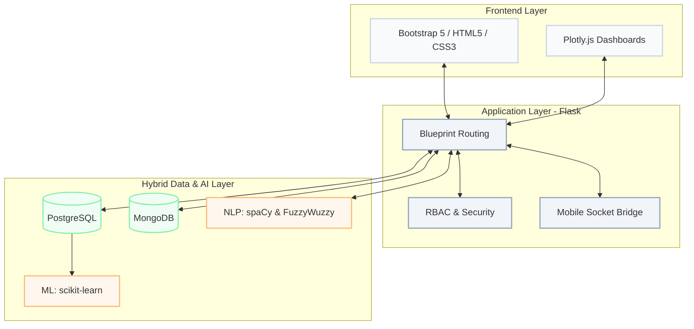
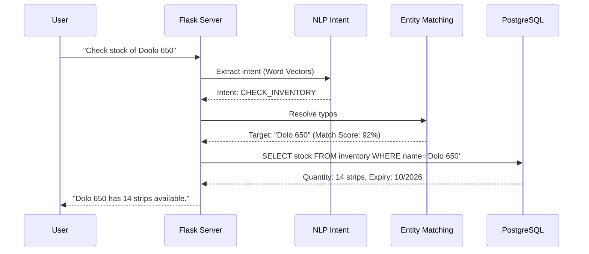

<div align="center">
  
  # 💊 PharmaTrust 
  **AI-Driven & Hybrid-Architecture Pharmacy Management System**

  <p align="center">
    
    
    
    
    
  </p>

  > *Transforming traditional pharmacy POS systems into intelligent, data-driven healthcare hubs using Machine Learning and NLP.*

</div>

<br />

## ✨ Core Innovations

| Feature | Description |
| :--- | :--- |
| 📈 **Predictive Forecasting** | Analyzes 30-day sales velocity using **Linear Regression** to generate proactive 7-day revenue and stock projections. |
| 📦 **Smart Bundling (KNN)** | Conducts Market Basket Analysis using **Cosine Similarity** to automatically recommend frequently co-purchased items. |
| 🤖 **NLP Pharmabot** | Processes natural language queries via **spaCy** to check stock and sales, with **FuzzyWuzzy** handling complex spelling typos. |
| 🚨 **Financial Dead Stock** | Quantifies financial exposure by tracking >90 days of dormant inventory, prioritizing alerts by `(Quantity × Cost)`. |
| 📱 **Zero-Config Mobile Bridging**| Uses dynamic socket resolution to spin up secure local servers for mobile QR uploads without needing internet access. |

<br />

## 🛠️ Technology Stack & Attribution

A breakdown of the core libraries and how they power the PharmaTrust architecture:

### 🧠 Artificial Intelligence & Data Logic
* **`scikit-learn`**: Drives the predictive analytics engine (Linear Regression for forecasting, KNN for product bundling).
* **`spaCy` & `en_core_web_md`**: Processes pharmacist input into semantic word vectors for intent classification.
* **`FuzzyWuzzy`**: Resolves Levenshtein distance for misspelled generic and brand medicine names.
* **`pandas` & `NumPy`**: Transforms raw SQL output into structured mathematical matrices for ML consumption.

### 🗄️ Hybrid Database Architecture
* **`PostgreSQL` & `psycopg2`**: The relational core enforcing strict 3NF ACID-compliant transactions for sales and inventory.
* **`MongoDB` & `PyMongo`**: The flexible NoSQL storage engine handling semi-structured clinical documents and scanned prescriptions.

### ⚙️ Backend & Frontend
* **`Flask` & `Werkzeug`**: Modular Blueprint architecture handling RESTful routing, secure sessions, and PBKDF2-SHA256 hashing.
* **`Bootstrap 5` & `Plotly.js`**: Renders the responsive grid UI and interactive visualization dashboards.

<br />

## 🏗️ System Architecture

PharmaTrust follows a secure, 3-tier architecture with Role-Based Access Control (RBAC), fully separating UI from the business logic.

<details open>
<summary><b>Click to View Architecture Diagram</b></summary>
<br>


</details>

<br />

## 🔄 NLP Query Execution Flow

How the system handles a pharmacist asking: *"Check stock of Doolo 650"*

<details>
<summary><b>Click to View Request Flow</b></summary>
<br>


</details>

<br />

## 🚀 Quick Start Guide

<details>
<summary><b>Local Installation Steps</b></summary>

**1. Clone the repository**
```bash
git clone [https://github.com/yourusername/PharmaTrust.git](https://github.com/yourusername/PharmaTrust.git)
cd PharmaTrust
```

**2. Setup Virtual Environment**
```bash
python -m venv venv
source venv/bin/activate  # Windows: venv\Scripts\activate
```

**3. Install Dependencies**
```bash
pip install -r requirements.txt
python -m spacy download en_core_web_md
```

**4. Environment Variables (`.env`)**
```env
PG_DB=pharmatrust_db
PG_USER=postgres
PG_PASS=yourpassword
MONGO_URI=mongodb://localhost:27017/
```

**5. Launch Server**
```bash
python app.py
```
</details>

---

<div align="center">
  <i>Developed to optimize healthcare inventory and eliminate dead stock.</i>
</div>
